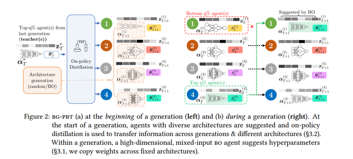

# Code for Bayesian Generational Population-based Training (BG-PBT)



**Demo of BG-PBT on Brax environments**

<p align="center">


</p>

(Note that the Hopper environment in Brax is [especially challenging](https://github.com/google/brax/issues/129))

**Link to paper**:
[Bayesian Generational Population-Based Training](https://openreview.net/forum?id=HW4-ZaHUg5)

**Authors**: Xingchen Wan, Cong Lu, Jack Parker-Holder, Philip J. Ball, Vu Nguyen, Binxin Ru, Michael A. Osborne

In Proceedings of the _First International Conference on Automated Machine Learning (AutoML-Conf)_, 2022.

If you find our work to be useful, please cite:

```
@inproceedings{
wan2022bayesian,
title={Bayesian Generational Population-Based Training},
author={Xingchen Wan and Cong Lu and Jack Parker-Holder and Philip J. Ball and Vu Nguyen and Binxin Ru and Michael A. Osborne},
booktitle={First Conference on Automated Machine Learning (Main Track)},
year={2022},
url={https://openreview.net/forum?id=HW4-ZaHUg5}
}
```

## Dependencies

We provide a requirements file at `requirements.txt` which may be used as follows:

```
conda create --name bgpbt --file requirements.txt
```

For a CPU-only version, please change `requirements.txt` to `requirements_cpu.txt`.
However, we did not thoroughly test on CPU-only builds.

**Particular attention should be paid to Brax** -- a package that is still very much under active development.
Different versions often lead to significant discrepancies in the results - **our paper uses the 0.10.0 version**.

## Scripts to run experiments in the paper

### Main experiments

Full BGPBT (with architectures) -- note that we have different hyperparameters for Humanoid and Hopper -- see Appendix
for details for this & delete as appropriate for the seed.

```
python3 main.py -v -e ant --pop_size 8 -mp 4 -qf 0.125 -ni 24 -exist overwrite -tr 1_000_000 -mt 150_000_000 -o bgpbt --seed {0,1,2,3,100,200,300} -sm both  -td 30_000_000
python3 main.py -v -e halfcheetah --pop_size 8 -mp 4 -qf 0.125 -ni 24 -exist overwrite -tr 1_000_000 -mt 150_000_000 -o bgpbt --seed {0,1,2,3,100,200,300} -sm both  -td 30_000_000
python3 main.py -v -e humanoid --pop_size 8 -mp 4 -qf 0.125 -ni 24 -exist overwrite -tr 5_000_000 -te 1_000_000 -mt 150_000_000 -o bgpbt --seed {0,1,2,3,100,200,300} -sm both  -td 40_000_000 -de 60_000_000 -md 1
python3 main.py -v -e hopper --pop_size 8 -mp 4 -qf 0.125 -ni 24 -exist overwrite -tr 5_000_000 -te 1_000_000 -mt 150_000_000 -o bgpbt --seed {0,1,2,3,100,200,300} -sm both  -td 40_000_000 -de 60_000_000 -md 1
python3 main.py -v -e fetch --pop_size 8 -mp 4 -qf 0.125 -ni 24 -exist overwrite -tr 1_000_000 -mt 150_000_000 -o bgpbt --seed {0,1,2,3,100,200,300} -sm both  -td 30_000_000
python3 main.py -v -e reacher --pop_size 8 -mp 4 -qf 0.125 -ni 24 -exist overwrite -tr 1_000_000 -mt 150_000_000 -o bgpbt --seed {0,1,2,3,100,200,300} -sm both -td 30_000_000
python3 main.py -v -e ur5e --pop_size 8 -mp 4 -qf 0.125 -ni 24 -exist overwrite -tr 1_000_000 -mt 150_000_000 -o bgpbt --seed {0,1,2,3,100,200,300} -sm both -td 30_000_000
```

Here we briefly explain the meaning of the most notable flags (full descriptions may be found in `./test_scripts/run_pbt.py`:

`-e`: environment {ant/halfcheetah/humanoid/hopper/fetch/reacher/ur5e}

`--pop_size`: population size: we use 8 for all experiments, although in the appendix we show the result with 24 agents

`-mp --max_parallel`: maximum parallel agents to **actually** run at the same time up to ''pop_size''.
This needs to be adjusted based on the VRAM of your GPU. On a single Nvidia GeForce 3090 with 24 GB of VRAM,
`-mp=4` is safe for all experiments except for Humanoid (where 2 is used). Note that a smaller `-mp`
will lead to slower wall-clock speed, but should not affect the results as the algorithm will
still wait for the entire population to finish before running the next iteration (synchronous).

`-qf --quantile_fraction`: the percentage of agents to be replaced at each iteration.

`-ni`: number of initialising agents

`-o --optimizer`: bgpbt/pbt/pb2

### Ablation studies

BGPBT without distillation and architecture search

```
python3 main.py -v -e ant --pop_size 8 -mp 4 -qf 0.125 -ni 24 -exist overwrite -tr 1_000_000 -mt 150_000_000 -o bgpbt --seed {0,1,2,3,100,200,300} -sm hpo
python3 main.py -v -e halfcheetah --pop_size 8 -mp 4 -qf 0.125 -ni 24 -exist overwrite -tr 1_000_000 -mt 150_000_000 -o bgpbt --seed {0,1,2,3,100,200,300} -sm hpo
python3 main.py -v -e humanoid --pop_size 8 -mp 4 -qf 0.125 -ni 24 -exist overwrite -tr 5_000_000 -te 1_000_000 -mt 150_000_000 -o bgpbt --seed {0,1,2,3,100,200,300} -sm hpo
python3 main.py -v -e hopper --pop_size 8 -mp 4 -qf 0.125 -ni 24 -exist overwrite -tr 5_000_000 -te 1_000_000 -mt 150_000_000 -o bgpbt --seed {0,1,2,3,100,200,300} -sm hpo
python3 main.py -v -e fetch --pop_size 8 -mp 4 -qf 0.125 -ni 24 -exist overwrite -tr 1_000_000 -mt 150_000_000 -o bgpbt --seed {0,1,2,3,100,200,300} -sm hpo
python3 main.py -v -e reacher --pop_size 8 -mp 4 -qf 0.125 -ni 24 -exist overwrite -tr 1_000_000 -mt 150_000_000 -o bgpbt --seed {0,1,2,3,100,200,300} -sm hpo
python3 main.py -v -e ur5e --pop_size 8 -mp 4 -qf 0.125 -ni 24 -exist overwrite -tr 1_000_000 -mt 150_000_000 -o bgpbt --seed {0,1,2,3,100,200,300} -sm hpo
```

### Checkpoints to visualize the policies

We include some checkpoints in `./ckpts` and a notebook to quickly render policies found by BGPBT.
Animations & more contents may be found in https://sites.google.com/view/bgpbt
